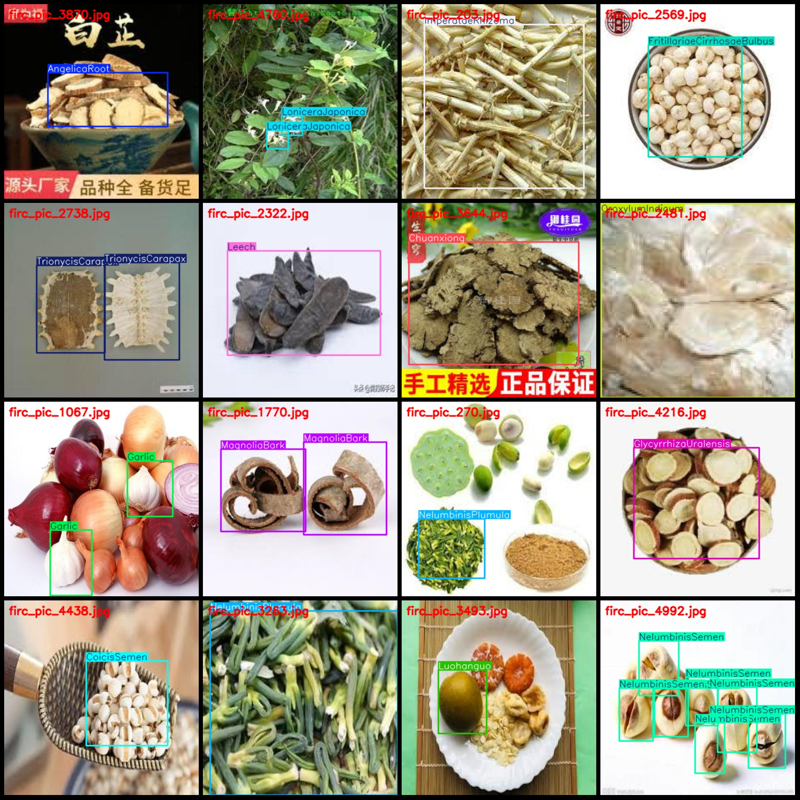
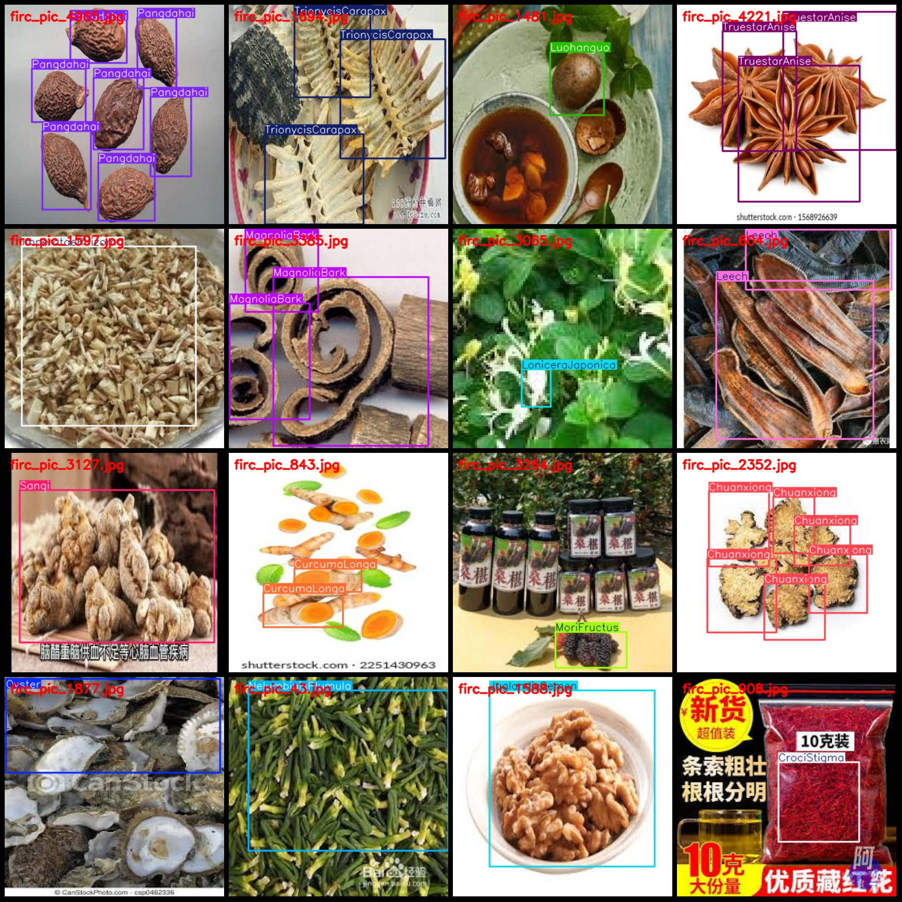

# 50 Common Chinese Herbal Medicine Identification and Detection Dataset in VOC+YOLO Format, 50 Categories

## Dataset format:
- Pascal VOC format + Yolov3 format
- Without segmentation paths, only txt files containing jpg images and their corresponding VOC and YOLOF format xml and txt files.

## Number of images (JPG file count):
- 5085

## Annotation Number (XML File Count):
- 5085

Yolo format txt file count:
- 5085

The number of labeled categories.
- 50 category

Annotation
Angelica Root
1. AntelopeHom (Antelope Horn)
2. ArecaeSemen (Areca Seed Semen)
4. Atractylodes Macrocephala (Atractylodes Macrocephala)
5. Bupleuri Radix (Radix Bupleuri)
6. Chrysanthemi Flos (Flos Chrysanthi)
7. Chuanxiong (Chuan Xiong)
8. Cicadae Periostracum (Periostracum of Cicada)
9. Clam Shell (Shell of Clam)
10. Coicis Semen
11. Coptidis Rhizoma (Coptis Rhizoma)
12. Crocus stigma (Crocus sativus)
13. Curcuma longa (Curcuma longa)
14. Dioscoreae Rhizoma
15. Eucommia Bark (Eucommia)
16. Eupolyphaga Sinensis (Tuber of Earthworm)
17. Fritillaria Cirrhosae Bulb (Chinese Yin-tongue)
18. Garlic (Garlic)
19. Ginkgo Biloba (Ginkgo Leaf)
20. Glycyrrhiza Uralensis (Licorice Root)
21. Hawthorn (Hawthorn Berry)
22. Houttuynia Herba (Houttuynia Herb)
23. Imperata Rhizoma (White Clover Root)
24. Juglandis Semen (Walnut Seed)
25. Jujubae Fructus (Jujube Fruit)
26. Leech (Water Micellary Cuttlefish)
27. Lilium Bulb (Lily Bulb)
28. Lonicera Japonica (Japanese Honeysuckle)
29. Luohanguo (Luohangguo)
30. LyciiFructus (Goji berry)
31. MagnoliaBark (Magnolia bark)
32. MoriFructus (Mulberry fruit)
33. MumeFructus (Black plum fruit)
34. NelumbinisPlumula (Lotus leaf heart)
35. NelumbinisSemen (Lotus seed)
36. OroxylumIndicum (Butterfly weed/Bergamot)
37. Oyster (Oyster)
38. Pangahai (Panagai)
39. PiperCubeba (Piper longum/Piper cubeba)
40. Sanqi (San Qi)
41. Scolopendra (Scorpion)
42. Scorpion (Whole scorpion)
43. Seahorse (Seahorse)
44. SerpentisPeriostracum (Snake skin)
45. TallGastrodiae (Tonic Gastrodia)
46. TetrapanacisMedulla (Stone-of-Panax)
47. TrionycisCarapax (Trionyx Carapax)
48. TruestarAnise (Star Anise)
49. Zhizi (Gardenia Japonica)
50. ginseng (Panax Ginseng)
## Images

Here is a pay link on Stripe ( https://buy.stripe.com/3cs8yP7sY87d0vu9AB ). Please contact me lonlonago@foxmail.com after funding $89, and I will send you a complete data files , thank you!

